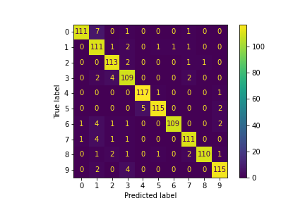

<!-- PROJECT LOGO -->
 

  <h3 align="center">Regressive Reasoning</h3>

  

    Brand Logo Classification
  

<!-- TABLE OF CONTENTS -->

  
Table of Contents

  <ol>
    <li>
      <a href="#about-the-project">About The Project</a>
      <ul>
        <li><a href="#built-with">Built With</a></li>
      </ul>
    </li>
    <li>
      <a href="#getting-started">Getting Started</a>
      <ul>
        <li><a href="#dependencies">Dependencies</a></li>
        <li><a href="#installation">Installation</a></li>
      </ul>
    </li>
    <li><a href="#usage">Usage</a></li>
    <li><a href="#roadmap">Roadmap</a></li>
    <li><a href="#contributing">Contributing</a></li>
    <li><a href="#license">License</a></li>
    <li><a href="#authors">Authors</a></li>
    <li><a href="#acknowledgements">Acknowledgements</a></li>
  </ol>

<!-- ABOUT THE PROJECT -->
## About The Project

This project classifies 10 brand logo. The integer encoding is as follows:
* 0 : Nike
* 1 : Adidas
* 2 : Ford
* 3 : Honda
* 4 : General Mills
* 5 : Unilever
* 6 : McDonald's
* 7 : KFC
* 8 : Gator
* 9 : 3M

[Project link](https://github.com/UF-FundMachineLearning-Summer23/final-project---code-report-regressive-reasoning)

Confusion matrix

<!-- GETTING STARTED -->
## Getting Started

The project was done on the HiPerGator supercomputer network, using the Tensorflow-2.7.0 kernel.

### Dependencies

Tensorflow-2.7.0 kernel library versions:

* Numpy 1.22.3

* Tensorflow 2.7.0

* sklearn 0.24.2 (for train-test-split for splitting data)

* Matplotlib (for display images and plotting results)

### Installation

1. Import all files into HiPerGator storage
* test.ipynb
* train.ipynb
* efficientnetv2-s.tar [Link to file](https://drive.google.com/file/d/1JoS2xVaANyANP1EN6pCxgo1rcBlN2XRz/view?usp=sharing)

The filepath should look like so:
* Folder
  * test.ipynb
  * train.ipynb
  * efficientnetv2-s.tar.gz (which will be extracted in Usage step)
  * easy_data.npy (or whatever filename the test images will be)
  * easy_labels.npy (or whatever filename the test labels will be)

2. Import image data into HiPerGator Storage

3. Run jupyter notebooks using Tensorflow-2.7.0 kernel on HiPerGator

<!-- USAGE EXAMPLES -->
## Usage

Make sure you only have a singular Kernel active at a time to prevent crashes.

Uncompress the efficientnetv2-s.tar.gz by running the following command on the HiPerGator terminal window:

- tar -xvzf efficientnetv2-s.tar.gz

Ensure that the uncompressed efficientnetv2-s folder lies in the same folder as the remaining files cited above. 

#### Easy Dataset instructions
In test.ipynb, if loading a new dataset move to the second code block and adjust the variables "data_path" and "labels_path" to the appropriate relative file locations to load the test images and labels. The "test" function is designated to be used for the easy dataset.

#### Hard Dataset instructions
Included in the document we have an additional "test_hard" function for the extra credit hard dataset. In the third code block adjust the variables "hard_data_path" and "hard_labels_path" to the appropriate relative file locations to load the hard test images and labels. When perfoming hard test, uncomment the data loading functions.

<!-- ROADMAP -->
## Roadmap

1. Further improvement in reporting of objects that cannot be classified, labeling them as -1.
2. Increase model accuracy by implementing image augmentation. 
3. Implement different model architectures for comparison purposes.  

<!-- LICENSE -->
## License

Distributed under the MIT License. See `LICENSE` for more information.

<!-- Authors -->
## Authors

Matheus Kunzler Maldaner - [Github](https://github.com/matheusmaldaner)

Pedro Moss - [Github](https://github.com/p4moss12)

Ruo Chen - chenruo@ufl.edu

Report Link: [https://github.com/UF-FundMachineLearning-Summer23/final-project---data-collection-regressive-reasoning/blob/main/Final_Project___EEL5840_EEE4773_Summer_2023.pdf](https://github.com/UF-FundMachineLearning-Summer23/final-project---data-collection-regressive-reasoning/blob/main/Final_Project___EEL5840_EEE4773_Summer_2023.pdf)

<!-- ACKNOWLEDGEMENTS -->
## Acknowledgements

* Catia Silva for instructing the course
* Andrew Jensen, Bradley Johnson and Mengdi Zhu for TAing the course
* Other groups that helped gathering the dataset

## Thank you
